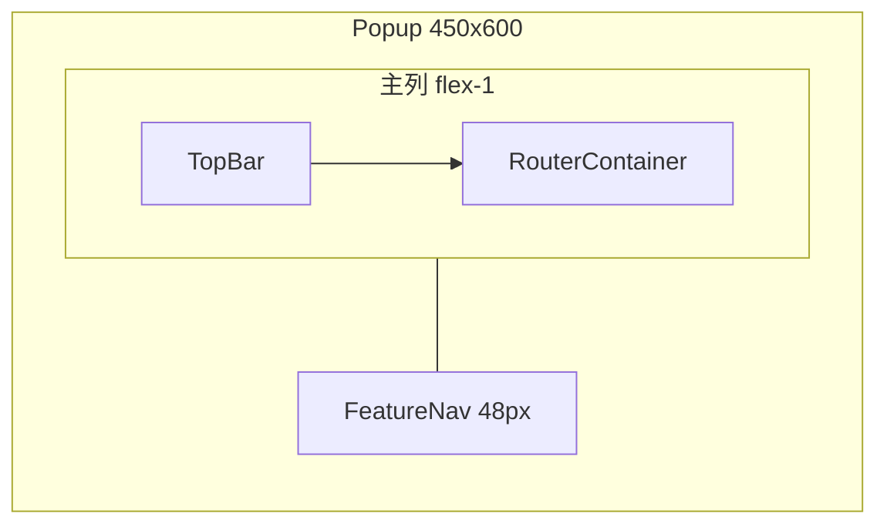

# Popup 布局重构 — 功能导航与 Dashboard 移除

> 创建时间: 2026-07-05
> 状态: 待实施
> 关联模块: `src/entrypoints/popup/`、`src/layout/FeatureNav/`、`src/providers/RouterProvider.tsx`
> 影响范围: 仅 popup 入口（tab / sidepanel 不在本次布局范围）

## 背景与目标

当前 popup 采用 **Dashboard 首页 + TopBar 搜索跳转** 模式：用户打开扩展后先看到仪表盘卡片网格，再点击进入具体工具。布局为固定 400×600（见 `src/entrypoints/popup/App.tsx` 与 `src/entrypoints/popup/index.html`），TopBar 在非 dashboard 页面显示「返回首页」按钮。

该模式增加了一步选工具操作。本次重构将 popup 改为 **工具直达 + 右侧常驻导航**，并移除 Dashboard 页面。

| 维度       | 现状                          | 目标                                      |
| ---------- | ----------------------------- | ----------------------------------------- |
| 默认页     | `dashboard`                   | 新用户默认 `timestamp`                    |
| 导航       | Dashboard 卡片网格 + 搜索跳转 | 右侧常驻纯图标导航栏                      |
| 首页       | Dashboard 独立页              | 移除                                      |
| Popup 宽度 | 400px                         | 450px（内容区 ~402px + 导航栏 48px）      |
| 作用范围   | —                             | 仅 popup 改布局；tab / sidepanel 不加导航 |

---

## 布局设计

### 结构示意



### 尺寸约束

| 属性     | 值     | 说明                                           |
| -------- | ------ | ---------------------------------------------- |
| 总宽度   | 450px  | `App.tsx` 容器 + `index.html` 内联样式同步修改 |
| 总高度   | 600px  | 不变                                           |
| 主内容列 | flex-1 | 约 402px，需 `min-w-0` 防止 flex 子项溢出      |
| 导航栏   | 48px   | Tailwind `w-12`，固定宽度，不参与 flex 收缩    |

### 视觉规范

- 导航栏：左侧 `border-l border-border`，垂直排列图标按钮
- 图标按钮：`h-9 w-9` 或 `h-10 w-10`，纯图标
- Tooltip：使用原生 `title` 属性 + `aria-label={feature.label}`，不引入 Tooltip 组件
- Active 态：背景 `bg-muted` + 左侧 `border-l-2 border-primary`
- 导航列表超出高度时：`overflow-y-auto`（600px 高度下 9 个工具通常无需滚动）

---

## FeatureNav 组件规格

新建 `src/layout/FeatureNav/`，遵循 UI + Hook 分离模式（见 `.github/CODING_STANDARDS.md` §11）。

### 文件结构

```
src/layout/FeatureNav/
├── index.tsx              # 垂直图标按钮列表、active 高亮、无障碍属性
├── useFeatureNav.ts       # 读路由状态，暴露 navItems / navigateTo / currentPage
├── resolveNavFeatures.ts  # 从 Dashboard 迁出的功能列表解析逻辑
└── __tests__/
    ├── index.test.tsx
    └── resolveNavFeatures.test.ts
```

### resolveNavFeatures.ts

从 `src/pages/Dashboard/dashboardFeatures.ts` 迁出并重命名：

```typescript
export interface NavFeatureItem {
  key: PageType;
  feature: FeatureConfig & { icon: NonNullable<FeatureConfig['icon']> };
}

export function resolveNavFeatures(keys: PageType[], visiblePages: PageType[]): NavFeatureItem[];
```

逻辑与旧 `resolveDashboardFeatures` 一致：

- 按 `keys`（即 `pageOrder`）顺序遍历
- 跳过不在 `visiblePages` 中的项
- 跳过无 `icon` 的 feature（dashboard 移除后不应出现）

### useFeatureNav.ts

```typescript
export interface UseFeatureNavReturn {
  navItems: NavFeatureItem[];
  currentPage: PageType;
  navigateTo: (page: PageType) => void;
}
```

- 从 `useRouter()` 读取 `currentPage`、`pageOrder`、`visiblePages`、`navigateTo`
- 用 `useMemo` 调用 `resolveNavFeatures(pageOrder, visiblePages)` 生成 `navItems`

### index.tsx

- 渲染 `<nav aria-label="功能导航">` 包裹垂直按钮列表
- 每项为 `<button type="button">`，内含 Lucide 图标
- 点击调用 `navigateTo(item.key)`
- 当前项添加 active 样式与 `aria-current="page"`

### 引用范围

**仅** `src/entrypoints/popup/App.tsx` 引用 `FeatureNav`。sidepanel / tab 入口不引入该组件。

---

## popup/App.tsx 目标结构

```tsx
import RouterProvider from '@/providers/RouterProvider';
import TopBar from '@/layout/TopBar';
import FeatureNav from '@/layout/FeatureNav';
import RouterContainer from '@/components/RouterContainer';
import ErrorBoundary from '@/components/ErrorBoundary';

export default function App() {
  return (
    <RouterProvider
      defaultRoute="timestamp"
      syncKey="app/popupRoute"
      visiblePagesKey="app/popupVisiblePages"
      pageOrderKey="app/popupPageOrder"
    >
      <div className="flex w-[450px] max-w-[450px] min-w-[450px] h-[600px] min-h-[600px] overflow-hidden bg-background">
        <div className="flex flex-col flex-1 min-w-0">
          <TopBar />
          <ErrorBoundary>
            <RouterContainer />
          </ErrorBoundary>
        </div>
        <FeatureNav />
      </div>
    </RouterProvider>
  );
}
```

`src/entrypoints/popup/index.html` 内联样式中 `width: 400px` 改为 `width: 450px`。

---

## 移除 Dashboard（全局类型变更）

布局仅改 popup，但 `dashboard` 从 `PageType` 移除会影响全项目类型与路由校验。

### 删除文件

| 路径                                  | 说明             |
| ------------------------------------- | ---------------- |
| `src/pages/Dashboard/`                | 整目录（含测试） |
| `src/config/pageLoaders/dashboard.ts` | Dashboard 懒加载 |

### 修改文件

| 文件                                 | 改动                                                        |
| ------------------------------------ | ----------------------------------------------------------- |
| `src/types/storage.d.ts`             | 从 `PageType` 联合类型删除 `'dashboard'`                    |
| `src/config/featureMeta.ts`          | 删除 dashboard 条目                                         |
| `src/config/pageLoaders/index.ts`    | 删除 `case 'dashboard'`                                     |
| `src/components/RouterContainer.tsx` | 去掉 dashboard 骨架屏分支；统一使用 `page-transition-enter` |
| `src/components/PageSkeleton.tsx`    | 删除 `variant: 'dashboard'` 及对应 UI                       |
| `src/styles/shell.css`               | 删除 `.page-transition-dashboard`                           |

### TopBar 精简

`src/layout/TopBar/index.tsx` 与 `useTopBar.ts`：

- 删除「返回首页」按钮（`ArrowLeft` + `goHome`）
- 删除 `isDashboard` 状态及相关导出
- 搜索过滤中 `f.key === 'dashboard'` 的特殊排除逻辑可删除

### RouterProvider 变更

`src/providers/RouterProvider.tsx`：

- 删除 `goHome()` 方法及 Context 中的 `goHome` 字段
- 全局 `defaultRoute` 默认值由 `'dashboard'` 改为 `'timestamp'`
- popup 显式传入 `defaultRoute="timestamp"`（与全局默认一致，便于阅读）

### Sidepanel 最小修复

`src/entrypoints/sidepanel/App.tsx` 若仍存在：

- `defaultRoute="dashboard"` 改为 `defaultRoute="timestamp"`
- 不添加 FeatureNav 布局

---

## 默认路由策略（仅新用户）

利用现有 `RouterProvider` 机制，**无需额外迁移代码**。

```typescript
// 首屏（localStorage 快照，消除闪烁）
const [currentPage] = useState(() => getSyncSnapshot(syncKey, defaultRoute, isValidPage));

// 异步加载 chrome.storage
const savedRoute = (stored[syncKey] ?? defaultRoute) as PageType;
if (isValidPage(savedRoute) && syncRoute && !hasUserNavigatedRef.current) {
  setCurrentPage(savedRoute);
}
```

| 场景                                       | 行为                                                             |
| ------------------------------------------ | ---------------------------------------------------------------- |
| 新用户（无 `app/popupRoute`）              | 首屏 + 持久化均为 `timestamp`                                    |
| 老用户（如 `app/popupRoute: 'jsonTools'`） | 恢复上次路由                                                     |
| 老用户曾存 `dashboard`                     | `isValidPage('dashboard')` 为 false → 回退 `timestamp`（软迁移） |
| 右键菜单 deep link                         | `?feature=&payload=` 优先级不变，高于默认路由                    |
| 用户主动切换                               | `navigateTo` 后 `hasUserNavigatedRef` 阻止异步覆盖               |

`visiblePages` / `pageOrder` 中残留的 `dashboard` 由 `mergeWithDefaults` 自动滤除（不在新默认列表中）。

### 边界说明

`recentlyUsedTools` 若含已移除的 `dashboard` 等非法项，当前 `isValidPageList` 校验要求数组**全部**合法，失败时整表回退为 `[]`。影响：TopBar 搜索历史中的「最近使用」可能被清空。此为已知低影响边界；实现时可选优化为「过滤非法项保留合法项」，**非必须**。

---

## 实施顺序

```
1. 迁出 resolveNavFeatures + 新建 FeatureNav 组件与测试
2. 修改 popup/App.tsx 布局 + popup/index.html 宽度
3. 全局移除 dashboard（PageType → FEATURES → pageLoader → 删页面目录）
4. 精简 TopBar / RouterProvider / RouterContainer / PageSkeleton
5. 批量更新测试 → npm run typecheck && npm run test && npm run lint
```

---

## 验收标准

### A. 布局与导航（手动）

| 编号 | 步骤                                 | 期望                                           |
| ---- | ------------------------------------ | ---------------------------------------------- |
| A-1  | 首次安装（或清空 storage）打开 popup | 默认显示时间戳页，右侧导航 timestamp 项高亮    |
| A-2  | 依次点击各导航图标                   | 切换到对应工具页，active 态跟随当前页          |
| A-3  | hover 各导航图标                     | 显示中文功能名 tooltip（`title` 属性）         |
| A-4  | 使用过某工具后关闭再打开 popup       | 恢复上次路由（非 dashboard）                   |
| A-5  | 检查 popup 尺寸                      | 宽度 450px，高度 600px，内容区不被导航挤压溢出 |

### B. Dashboard 移除

| 编号 | 期望                                                                 |
| ---- | -------------------------------------------------------------------- |
| B-1  | TopBar 搜索下拉无 dashboard 项                                       |
| B-2  | TopBar 无「返回首页」按钮                                            |
| B-3  | `PageType`、`FEATURES`、`loadPage` 中无 dashboard                    |
| B-4  | storage 中 `app/popupRoute: 'dashboard'` 时打开 popup 落到 timestamp |
| B-5  | `visiblePages` 含 dashboard 时自动滤除，导航正常显示工具列表         |

### C. 单元测试

| 编号 | 覆盖                                                                       |
| ---- | -------------------------------------------------------------------------- |
| C-1  | `FeatureNav` 渲染全部可见工具图标                                          |
| C-2  | `FeatureNav` 点击图标调用 `navigateTo`                                     |
| C-3  | `FeatureNav` 当前页对应项有 active 样式 / `aria-current`                   |
| C-4  | `resolveNavFeatures` 按 pageOrder 排序、respect visiblePages               |
| C-5  | 更新 `RouterProvider` / `TopBar` / `RouterContainer` / `features` 相关测试 |
| C-6  | 删除 `src/pages/Dashboard/__tests__/` 下全部测试                           |

### D. CI

| 编号 | 标准                     |
| ---- | ------------------------ |
| D-1  | `npm run typecheck` 通过 |
| D-2  | `npm run test` 通过      |
| D-3  | `npm run lint` 通过      |

---

## 不在范围

- tab / sidepanel 布局改造（不加 FeatureNav）
- `visiblePages` / `pageOrder` 可视化配置 UI
- Popup 高度变更（保持 600px）
- 修改 `AGENTS.md` 中 spec 目录引用（实际 spec 位于 `docs/spec/`）

---

## PR 检查清单

```markdown
## 功能

- [ ] 新建 FeatureNav 组件（index / useFeatureNav / resolveNavFeatures）
- [ ] popup 布局改为双列（主内容 + 右侧导航）
- [ ] popup 宽度 450px（App.tsx + index.html）
- [ ] popup defaultRoute="timestamp"
- [ ] 全局移除 dashboard（PageType、FEATURES、pageLoader、页面目录）
- [ ] TopBar 移除返回按钮与 goHome 相关逻辑
- [ ] RouterProvider 移除 goHome，defaultRoute 改为 timestamp
- [ ] sidepanel defaultRoute 最小修复（若文件存在）

## 测试

- [ ] FeatureNav / resolveNavFeatures 单元测试
- [ ] 更新 RouterProvider / TopBar / RouterContainer / features 测试
- [ ] 删除 Dashboard 相关测试

## 验收

- [ ] npm run typecheck / test / lint 通过
- [ ] 手动 A-1 ~ A-5、B-1 ~ B-4 通过
```

---

## 风险与边界说明

1. **Dashboard 移除为全局变更**：虽 FeatureNav 仅 popup 使用，但 `PageType` 删除 `dashboard` 会影响所有入口的类型校验与路由合法性。
2. **老用户 dashboard 路由软迁移**：依赖 `isValidPage` 回退到 `defaultRoute`，不会 crash，但用户会察觉「首页消失、默认变为时间戳」——符合预期。
3. **450px 宽度**：Chrome popup 允许扩展较默认更宽；若未来 Firefox 有差异需在 Firefox 构建中手动验证。
4. **recentlyUsedTools 整表校验**：见「默认路由策略 → 边界说明」，可选后续优化。

---

## 相关文件索引

| 文件                                  | 说明                            |
| ------------------------------------- | ------------------------------- |
| `src/entrypoints/popup/App.tsx`       | popup 布局入口，引用 FeatureNav |
| `src/entrypoints/popup/index.html`    | popup 初始尺寸 450px            |
| `src/layout/FeatureNav/`              | 新建：右侧图标导航              |
| `src/layout/TopBar/`                  | 精简：移除返回按钮              |
| `src/providers/RouterProvider.tsx`    | 默认路由、移除 goHome           |
| `src/config/featureMeta.ts`           | FEATURES 定义，删除 dashboard   |
| `src/types/storage.d.ts`              | PageType 定义                   |
| `src/config/pageLoaders/index.ts`     | 页面懒加载路由                  |
| `src/components/RouterContainer.tsx`  | 页面渲染容器                    |
| `src/components/PageSkeleton.tsx`     | 加载骨架屏                      |
| `src/styles/shell.css`                | 页面过渡动画                    |
| `src/pages/Dashboard/`                | **删除**                        |
| `src/config/pageLoaders/dashboard.ts` | **删除**                        |
| `src/entrypoints/sidepanel/App.tsx`   | 最小修复 defaultRoute           |

---

> **注**：项目 spec 文档实际目录为 `docs/spec/`。`AGENTS.md` 中引用的根目录 `spec/README.md` 尚未建立，以本目录 [`README.md`](../README.md) 为索引。
