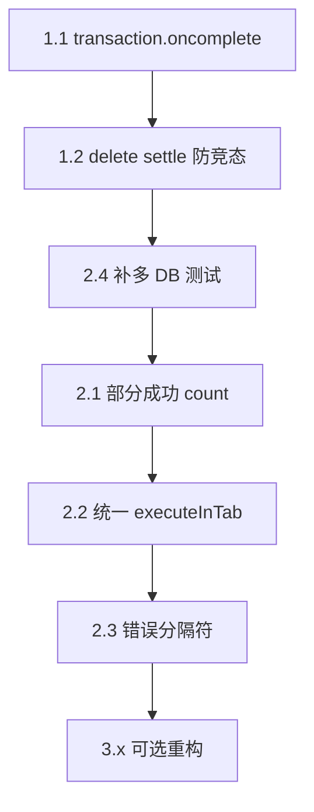

# Storage Cleaner — IndexedDB 修复方案与验收标准

> 创建时间: 2026-06-25
> 状态: ✅ Phase 3 已完成（2026-06-25）
> 关联模块: `src/utils/storageCleaner.ts`
> 前置审查: Code Review（`storageCleaner.ts` 修改版）

## 背景与目标

本次修复针对 `storageCleaner.ts` 中 IndexedDB 清理逻辑及错误处理链路的审查结论，按优先级分三阶段实施。

| 问题域              | 现状                                           | 目标                              |
| ------------------- | ---------------------------------------------- | --------------------------------- |
| IndexedDB fallback  | `store.clear()` 完成后立即 `db.close()`        | 等 transaction commit 后再关闭    |
| deleteDatabase 超时 | 超时后仍可能触发 `onsuccess`，与 fallback 并发 | 单次删除生命周期内只 resolve 一次 |
| 部分成功            | 多 DB 部分失败时 `count` 丢失                  | 失败结果保留已清理数量            |
| 代码结构            | `runScript` / `runCleanScript` 重复            | 统一 executeScript 入口           |
| 测试                | 缺多 DB 混合场景                               | 补单元测试覆盖                    |

---

## Phase 1 — 合并前必做（P1）

### 1.1 等待 IndexedDB transaction 完成后再关闭连接

#### 问题

`clearObjectStores` 在 `Promise.all(clearStore...)` 结束后立刻 `db.close()`。单个 `clearReq.onsuccess` 只表示 request 完成，transaction 可能尚未 commit，存在清空被回滚的风险。

#### 根因

IndexedDB 规范中，transaction 的持久化以 `transaction.oncomplete` 为准，而非单个 request 的 `onsuccess`。

#### 修复方案

在注入脚本内的 `clearObjectStores` 中，增加 `waitForTransaction` 辅助函数：

```typescript
const waitForTransaction = (tx: IDBTransaction): Promise<void> =>
  new Promise((resolve, reject) => {
    tx.oncomplete = () => resolve();
    tx.onerror = () => reject(tx.error ?? new Error('Transaction failed'));
    tx.onabort = () => reject(tx.error ?? new Error('Transaction aborted'));
  });
```

修改 `openReq.onsuccess` 分支：

```typescript
const transaction = db.transaction(storeNames, 'readwrite');
const errors = (
  await Promise.all(
    storeNames.map((storeName) => clearStore(transaction.objectStore(storeName), storeName)),
  )
).filter((error): error is string => Boolean(error));

try {
  await waitForTransaction(transaction);
} catch {
  db.close();
  resolve({
    success: false,
    errors: [`清空 IndexedDB 失败（${dbName}），请刷新后重试`],
  });
  return;
}

db.close();
resolve({ success: errors.length === 0, errors });
```

#### 涉及文件

- `src/utils/storageCleaner.ts` — `injectClearIndexedDB` 内 `clearObjectStores`

#### 新增测试

```typescript
it('should wait for transaction complete before closing db', async () => {
  // mock: clear onsuccess 先于 transaction.oncomplete 触发
  // 断言 db.close 在 transaction.oncomplete 之后调用
});
```

---

### 1.2 消除 deleteDatabase 超时竞态

#### 问题

超时 `resolve('timeout')` 后，`deleteReq.onsuccess` 仍可能触发；此时 fallback 的 `indexedDB.open` 与进行中的 `deleteDatabase` 可能并发，行为未定义。

#### 修复方案

为每个 DB 删除引入 **单次 settle** 状态：

```typescript
const waitForDeleteDatabase = (dbName: string, timeoutMs: number) =>
  new Promise<'deleted' | 'blocked' | 'timeout' | 'error'>((resolve) => {
    let settled = false;
    const settle = (status: 'deleted' | 'blocked' | 'timeout' | 'error') => {
      if (settled) return;
      settled = true;
      clearTimeout(timeout);
      resolve(status);
    };

    const deleteReq = indexedDB.deleteDatabase(dbName);
    const timeout = setTimeout(() => {
      console.warn('IndexedDB delete timeout:', dbName);
      settle('timeout');
    }, timeoutMs);

    deleteReq.onblocked = () => {
      console.warn('IndexedDB delete blocked:', dbName);
      settle('blocked');
    };
    deleteReq.onsuccess = () => settle('deleted');
    deleteReq.onerror = () => settle('error');
  });
```

#### timeout / blocked 后的 fallback 策略

| 状态      | 行为                                                               |
| --------- | ------------------------------------------------------------------ |
| `blocked` | 立即 fallback `clearObjectStores`（页面仍占用连接，open 通常可行） |
| `timeout` | 先 `await delay(100~200ms)` 再 fallback，降低与 delete 并发概率    |
| `error`   | 不 fallback，直接报错                                              |

#### 涉及文件

- `src/utils/storageCleaner.ts` — 替换现有 `new Promise` 删除逻辑

#### 新增测试

```typescript
it('should ignore late onsuccess after delete timeout', async () => {
  // deleteBehavior: timeout，5000ms 后 resolve timeout
  // 6000ms 后再触发 onsuccess
  // 断言：只走 fallback 一次，count 不因 late onsuccess 重复 +1
});
```

---

## Phase 2 — 建议同 PR 或紧接 follow-up（P2）

### 2.1 IndexedDB 部分成功时保留 count

#### 问题

多 DB 场景返回 `{ count: 2, errors: ['...'] }` 时，`runCleanScript` 只返回 `{ success: false, error }`，用户看不到已清理 2 个库。

#### 修复方案（推荐）

扩展失败分支类型，可选 `count`：

```typescript
// src/types/storage.d.ts
export type StorageCleanResult =
  | { success: true; count: number }
  | { success: false; error: string; count?: number }; // 部分成功时的已清理数
```

修改 `runCleanScript`：

```typescript
if (raw.errors?.length) {
  const errorMsg = raw.errors.join('\n');
  const partialHint = raw.count > 0 ? `（已成功清理 ${raw.count} 个数据库，但部分失败）\n` : '';
  return {
    success: false,
    error: partialHint + errorMsg,
    ...(raw.count > 0 ? { count: raw.count } : {}),
  };
}
```

#### UI 层（可选增强）

`CleaningResult.tsx` 失败时若 `result.indexedDB?.count` 存在，可展示部分成功提示（非必须，error 字符串已含 hint 即可）。

#### 涉及文件

- `src/types/storage.d.ts`
- `src/utils/storageCleaner.ts` — `runCleanScript`
- `src/utils/__tests__/storageCleaner.test.ts`
- （可选）`src/pages/StorageCleaner/components/CleaningResult.tsx`

#### 新增测试

```typescript
it('should preserve partial count when some IndexedDB databases fail', async () => {
  // 3 个 DB：2 成功删除，1 blocked 且 fallback 失败
  // expect: success false, count 2, error 含「已成功清理 2 个」
});
```

---

### 2.2 统一 executeScript 调用入口

#### 问题

`runScript` 与 `runCleanScript` 各自调用 `browser.scripting.executeScript`，行为不一致（吞错 vs 抛错）。

#### 修复方案

抽取底层函数：

```typescript
type ExecuteScriptMode = 'fallback' | 'throw';

async function executeInTab<T>(
  tabId: number,
  func: () => T | Promise<T>,
  options: { errorLabel: string; mode: 'fallback'; fallback: T },
): Promise<T>;
async function executeInTab<T>(
  tabId: number,
  func: () => T | Promise<T>,
  options: { errorLabel: string; mode: 'throw' },
): Promise<T>;
async function executeInTab<T>(...) {
  try {
    const [result] = await browser.scripting.executeScript({ target: { tabId }, func });
    return (result?.result as T) ?? (options.mode === 'fallback' ? options.fallback : undefined as T);
  } catch (error) {
    console.error(`Failed to ${options.errorLabel}:`, error);
    if (options.mode === 'throw') throw error;
    return options.fallback;
  }
}
```

- `runScript` → `executeInTab(..., { mode: 'fallback', fallback })`
- `runCleanScript` → `executeInTab(..., { mode: 'throw' })` + 结果解析

#### 涉及文件

- `src/utils/storageCleaner.ts`

#### 验收

现有 11 个测试全部通过，无行为回归。

---

### 2.3 错误信息分隔符统一

#### 问题

`runCleanScript` 用 `'; '` 拼接，`clearStorage` 的 `result.error` 用 `'\n'`，UI 用 `break-all` 展示，多错误时可读性不一致。

#### 修复方案

IndexedDB 内部多错误统一改为 `'\n'`：

```typescript
error: raw.errors.join('\n');
```

#### 涉及文件

- `src/utils/storageCleaner.ts`
- 相关测试断言（若有 `'; '` 期望）

---

### 2.4 补充多 DB 混合场景测试

| 用例               | 输入                           | 期望                                         |
| ------------------ | ------------------------------ | -------------------------------------------- |
| 全部成功           | 3 DB，均 delete success        | `success: true, count: 3`                    |
| 部分 fallback 成功 | 2 success + 1 blocked→clear OK | `success: true, count: 3`                    |
| 部分失败           | 2 success + 1 error            | `success: false, count: 2, error 含失败库名` |
| 空库列表           | `databases()` 返回 `[]`        | `success: true, count: 0`                    |

#### 涉及文件

- `src/utils/__tests__/storageCleaner.test.ts`
- 扩展 `createIndexedDBMock` 支持 per-db 不同 `deleteBehavior`

---

## Phase 3 — 可选优化（P3）

### 3.1 超时常量提升到模块级

```typescript
// src/utils/storageCleaner.ts 或 src/pages/StorageCleaner/constants.ts
const INDEXED_DB_DELETE_TIMEOUT_MS = 5000;
const INDEXED_DB_CLEAR_STORE_TIMEOUT_MS = 5000;
```

注入脚本通过闭包引用（executeScript 会序列化 func，常量需在 func 外部定义并 capture，或仍写在 func 内但从模块常量赋值）。

### 3.2 IndexedDB 逻辑拆分（长期）

将 `clearObjectStores`、`waitForDeleteDatabase` 等抽到 `src/utils/indexedDbCleaner.ts` 的纯函数，注入层只做：

```typescript
async () => clearAllIndexedDBs(INDEXED_DB_DELETE_TIMEOUT_MS);
```

便于单测，不依赖 `mockExecuteScriptEval` 间接执行注入函数。工作量大，建议单独 PR。

---

## 实施顺序



| 阶段    | 预估工作量 | 风险             |
| ------- | ---------- | ---------------- |
| Phase 1 | 0.5~1 天   | 低，逻辑局部     |
| Phase 2 | 0.5~1 天   | 中，涉及类型扩展 |
| Phase 3 | 1~2 天     | 低，可延后       |

---

## 验收标准

### A. 自动化（CI 必须通过）

```bash
npm run test -- src/utils/__tests__/storageCleaner.test.ts
npm run typecheck
npm run lint
```

| 编号 | 标准                                                                           |
| ---- | ------------------------------------------------------------------------------ |
| A-1  | 全部单元测试通过，新增测试 ≥ 3（transaction 顺序、late onsuccess、多 DB 混合） |
| A-2  | `tsc --noEmit` 无错误；若扩展 `StorageCleanResult`，所有引用处类型正确         |
| A-3  | ESLint `--max-warnings=0` 通过                                                 |

---

### B. 功能行为

| 编号 | 场景                                                 | 期望结果                                                                      |
| ---- | ---------------------------------------------------- | ----------------------------------------------------------------------------- |
| B-1  | 单 DB，`deleteDatabase` 成功                         | `indexedDB: { success: true, count: 1 }`，`overallSuccess: true`              |
| B-2  | 单 DB，`deleteDatabase` blocked，fallback clear 成功 | `success: true, count: 1`；transaction 在 `oncomplete` 后 `db.close`          |
| B-3  | 单 DB，delete 超时 5s，fallback clear 成功           | 5s 内进入 fallback；不因 late `onsuccess` 重复计数                            |
| B-4  | fallback 中某 store clear hang 5s                    | `success: false`，error 含 `dbName/storeName`                                 |
| B-5  | 3 DB：2 成功 + 1 失败                                | `success: false`，`count: 2`（Phase 2.1 后），error 含失败库名与部分成功提示  |
| B-6  | `executeScript` 注入失败                             | `success: false`，**不得** `{ success: true, count: 0 }`                      |
| B-7  | localStorage 成功 + cookies 失败                     | `overallSuccess: false`，`result.error` 为 `Cookies: ...`（换行分隔多项失败） |

---

### C. 回归与 UI

| 编号 | 标准                                                                                                      |
| ---- | --------------------------------------------------------------------------------------------------------- |
| C-1  | `formatCleaningResult` 成功路径不变                                                                       |
| C-2  | `CleaningResult` 失败时展示 `result.error`；含 `\n` 时多行可读（现有 `leading-relaxed break-all` 可接受） |
| C-3  | `reloadAfterClean=true` 且 `overallSuccess=false` 时不刷新页面（`useStorageCleaner` 现有逻辑）            |
| C-4  | Cookie 清理：domain 前导 `.` 剥离逻辑不变                                                                 |

---

### D. 手动验收（扩展环境）

在 Chrome 加载 unpacked extension，选普通 HTTPS 页面：

| 编号 | 步骤                                              | 期望                                                                    |
| ---- | ------------------------------------------------- | ----------------------------------------------------------------------- |
| D-1  | 页面写入 localStorage + IndexedDB，仅清 IndexedDB | 成功提示或明确错误；DevTools → Application → IndexedDB 数据为空或库已删 |
| D-2  | 打开 DevTools 保持 IndexedDB 面板，执行清理       | 若 blocked，显示中文提示；fallback 成功后数据不可见                     |
| D-3  | 勾选「清理后刷新」且全部成功                      | Toast「清理成功，即将刷新页面」，页面刷新                               |
| D-4  | 部分失败                                          | 不刷新；结果区红色展示错误详情                                          |

---

### E. 代码质量

| 编号 | 标准                                                               |
| ---- | ------------------------------------------------------------------ |
| E-1  | 注入脚本内无重复 `settled` / timeout 逻辑（删除与 clear 各自封装） |
| E-2  | 错误文案仍为中文，含库名/store 名                                  |
| E-3  | 无 `any`（测试文件除外）                                           |
| E-4  | Phase 1 合并后，P1 项在 PR 描述中标注「已修复」并附测试名          |

---

## PR 检查清单

```markdown
## 修复内容

- [ ] P1: transaction.oncomplete 后再 db.close
- [ ] P1: deleteDatabase settle 防竞态
- [ ] P2: 部分成功保留 count（可选）
- [ ] P2: 多 DB 混合测试
- [ ] P2: 错误信息 `\n` 分隔（可选）

## 验收

- [ ] npm run test / typecheck / lint 通过
- [ ] 新增测试覆盖 B-2、B-3、B-5
- [ ] 手动 D-1 ~ D-4 至少测 D-1、D-3
```

---

## 风险与边界说明

1. **fallback 清空 ≠ 删除库**：blocked 时只清 object store，库结构仍在；成功 `count` 表示「有效清理动作完成」，需在 UI/文档中说明（可选文案：「数据已清空，数据库结构可能仍存在」）。
2. **timeout 延迟 fallback**：100~200ms 为经验值，无法完全消除竞态，只能降低概率；完全消除需浏览器不支持 abort delete 的前提下接受 best-effort。
3. **类型扩展**：`StorageCleanResult` 加可选 `count` 为向后兼容；消费方用 `'count' in result && result.count` 判断即可。

---

## 相关文件索引

| 文件                                                     | 说明                                         |
| -------------------------------------------------------- | -------------------------------------------- |
| `src/utils/storageCleaner.ts`                            | 核心清理逻辑                                 |
| `src/utils/__tests__/storageCleaner.test.ts`             | 单元测试                                     |
| `src/types/storage.d.ts`                                 | `StorageCleanResult` / `CleaningResult` 类型 |
| `src/pages/StorageCleaner/constants.ts`                  | 选项标签与键名                               |
| `src/pages/StorageCleaner/useStorageCleaner.ts`          | 清理流程编排                                 |
| `src/pages/StorageCleaner/components/CleaningResult.tsx` | 结果展示 UI                                  |
